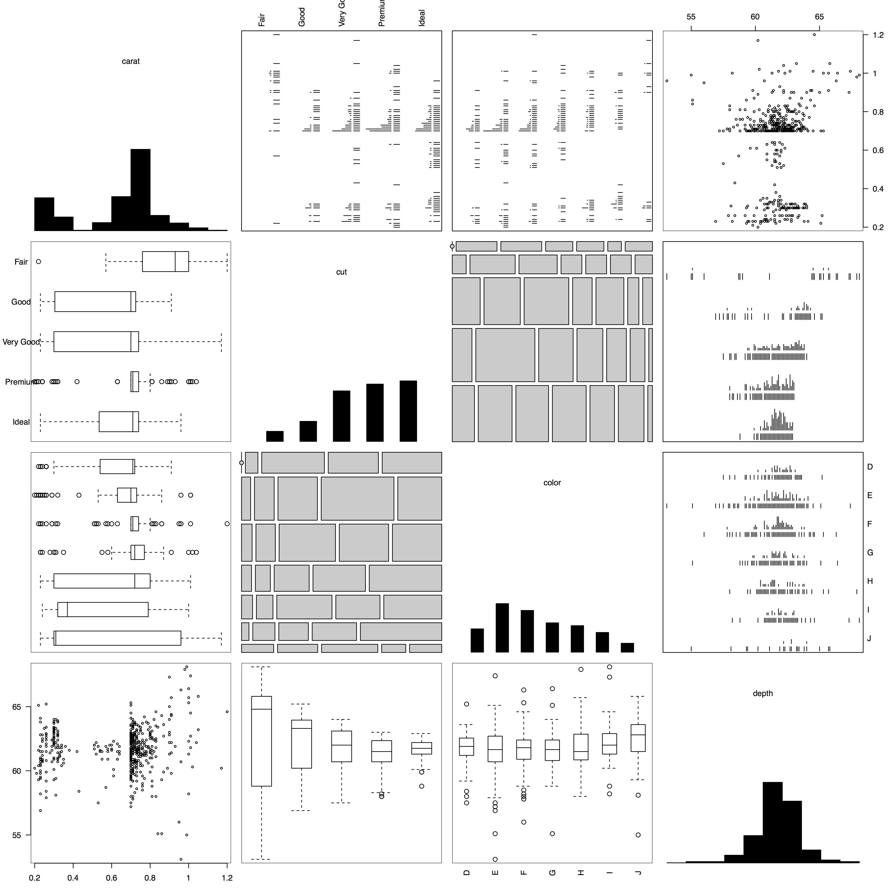

## About me

I'm an academic-- soon to be a Statistical and Data Sciences professor at Smith College. So, the methods I'm talking about came out of academia. They're still useful!

```{r, echo=FALSE}
library(knitr)
opts_knit$set(animation.fun = hook_scianimator, cache=TRUE)
knit_hooks$set(custom_plot = hook_plot_custom)
```


## Following along

All my code is on github, [https://github.com/AmeliaMN/BigDataDay](https://github.com/AmeliaMN/BigDataDay), or you can see the slides hosted on my site, [http://bit.ly/BDD15_viz](http://bit.ly/BDD15_viz).

## Big thoughts

Big data versus multidimensional data

Data visualizations we make for others versus data visualizations we make for ourselves

"The greatest value of a picture is when it forces us to notice what we never expected to see." - John Tukey, 1977

## Data for this talk
```{r loaddata}
library(ggplot2)
data(diamonds)
set.seed(123)
diamonds <- diamonds[sample(500),]
str(diamonds)
```

# Standard pairs plot / scatterplot matrix

----
```{r pairsplot, out.height="550", fig.align="center"}
plot(diamonds)
```

----
```{r subpairsplot, warning=FALSE, message=FALSE, fig.align="center"}
library(dplyr)
select(diamonds, carat, depth, table) %>% plot()
```

# Generalized pairs plot


## Generalized pairs plot
The pairs plot is useful on its own, but the generalized pairs plot is even better.

Emerson, J. W., Green, W. A., Schloerke, B., Crowley, J., Cook, D., Hofmann, H., and Wickham, H. (2013). The generalized pairs plot. Journal of Computational and Graphical Statistics, 22(1):79–91. 

[http://bit.ly/gpairs](http://bit.ly/gpairs)

----
```{r gpairsplot2, message=FALSE, fig.keep="none"}
library(gpairs)
gpairs(diamonds, outer.rot=c(90, 0))
```

<div class="centered"></div>

----
```{r gpairsplot3, message=FALSE, fig.keep="none"}
select(diamonds, carat, cut, color, depth) %>% gpairs(outer.rot=c(90, 0))
```
<div class="centered"></div>

# Grand Tour


## Grand Tour
The Grand Tour lets you explore multidimensional data more generically. 

Wickham, H., Cook, D., Hofmann, H., and Buja, A. (2011). tourr: An R package for exploring multivariate data with projections. Journal of Statistical Software, 40(2). 

[www.bit.ly/_tourr](www.bit.ly/_tourr)

----
```{r, eval=FALSE}
library(tourr)
select(diamonds, carat, depth, table, x, y, z) %>% animate(grand_tour(), display = display_xy(), fps=15)
```

```{r tourr, custom_plot=TRUE, fig.show='animate', fig.ext='png', echo=FALSE, message=FALSE, fig.num=300, interval=0.09, aniopts='loop, controls, autoplay', loopMode='sweep'}
library(tourr)
select(diamonds, carat, depth, table, x, y, z) %>% tourr::render(grand_tour(d = 2), display = display_xy(), frames=300, apf=1/15, dev="png", fig_path("%1d.png"), width=480, height=480)
Sys.sleep(1)
```

# Graphical inference

## Graphical inference
Wickham, H., Cook, D., Hofmann, H., and Buja, A. (2010). Graphical inference for infovis. IEEE Transactions on Visualization and Computer Graphics, 16(6).

[http://bit.ly/graphical_inference](http://bit.ly/graphical_inference)

----

```{r inference}
library(nullabor)
library(ggplot2)
qplot(carat, depth, data=diamonds) %+%
  lineup(null_permute('carat'), diamonds) +
  facet_wrap(~.sample)
```

----
```{r answers}
decrypt("OlCE bQTQ Aw GWPATAWw qd")
```

<div class="centered"></div>

# Tableplots

## Tableplots
Tennekes, M., de Jonge, E., and Daas, P. J., H. (2013). Visualizing and inspecting large datasets with tableplots. Journal of Data Science, 11(2013):43-58. 
[http://bit.ly/tabplot](http://bit.ly/tabplot)

----
```{r, message=FALSE}
library(tabplot)
tableplot(diamonds)
```

## CSV fingerprint
Powell, V. CSV Fingerpint. [www.bit/ly/csvfingerprint](www.bit/ly/csvfingerprint)

<div class="centered">
</div>

# Thank you!
